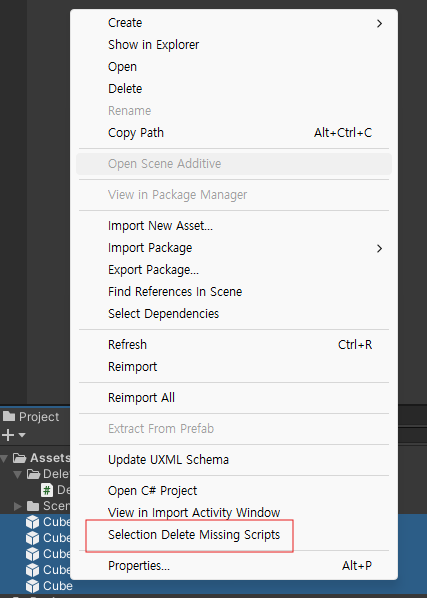
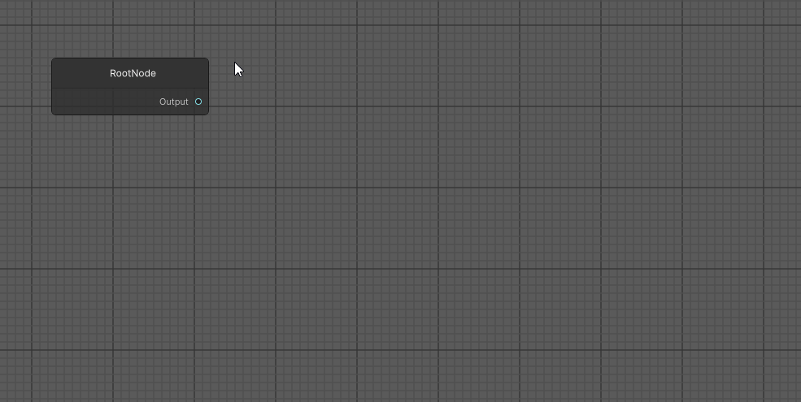

# Unity_Practice_Editor

## 구현된 기능

- [함수 실행 버튼](#함수-실행-버튼)
- [Missing Script 삭제](#missing-script-삭제)
- [Behaviour Tree Editor](#behaviour-tree-editor)

 
 

## 함수 실행 버튼

 

[폴더 링크](https://github.com/mintchobab/Unity_Practice_Editor/tree/main/Unity_Practice_Editor/Assets/MethodButtonAttribute)

 

[Button] Attribute를 추가하면 해당 함수를 인스펙터에서 실행시킬 수 있다.

 

 
 

## Missing Script 삭제

 

[폴더 링크](https://github.com/mintchobab/Unity_Practice_Editor/tree/main/Unity_Practice_Editor/Assets/DeleteMissingScript)

 

프리팹 내의 Missing Scirpt를 찾아서 삭제할 수 있습니다.

 

 
 

## Behaviour Tree Editor

 

[폴더 링크](https://github.com/mintchobab/Unity_Practice_Editor/tree/main/Unity_Practice_Editor/Assets/BehaviourTreeEditor)

 

블로그 개발 일지 : https://mintchobab.tistory.com/36

 

(현재 기능 제작중입니다.)

 

#### Node 타입별 생성 가능

 
 

#### Node Field & Property

 
 

#### Tree Settings

